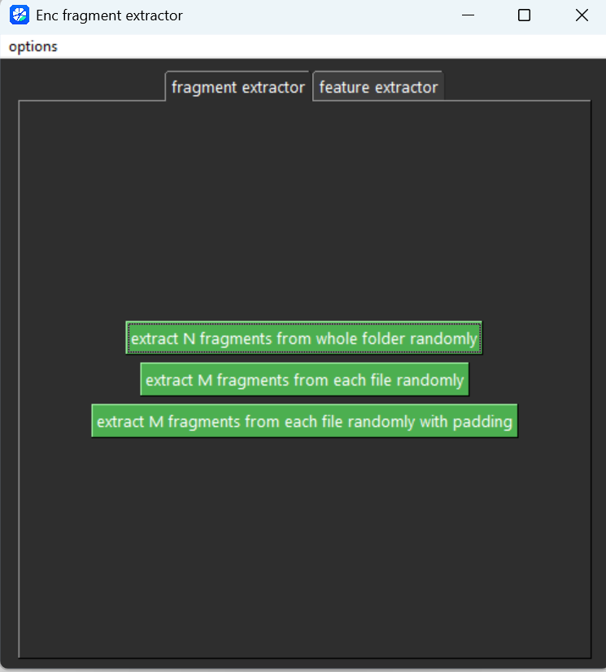
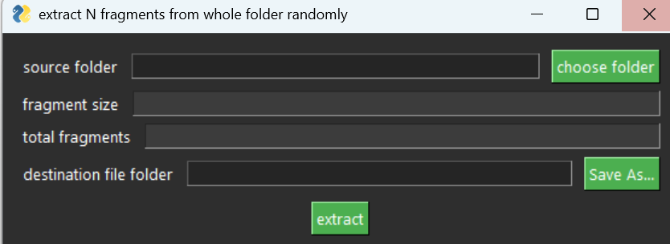
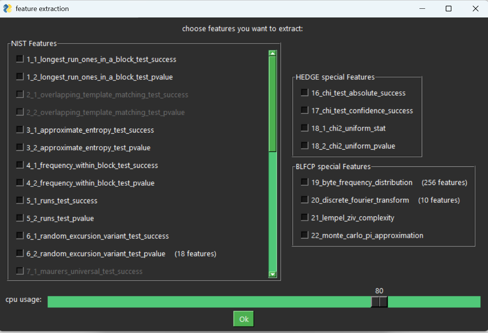

# Enc-fragment-extractor

this project is gui application for extracting fragments and the best features of the states of the arts to determine encrypted fragments from unecrypted ones 

## Features
- extracting fragments from whole dataset
- extracting fragments from each file
- extracting features parallelly
- state of the art models features such as NIST 800-22, HEDGE, EnCoD, BLFCP

## Graphical User Interface
 

## Downloads
- Get packaged builds from the Releases page.
- Source code archives are available with each release tag.

## Documentation
- open app read options->guidance and option->about.

## License
- GPL 3.0
